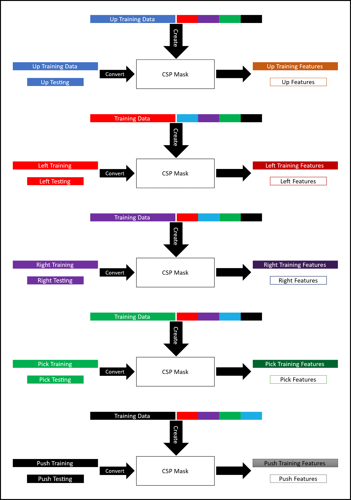

# Offline Processing
This folder holds the codebase for the offline processing implementation of my Computer Science M.Sc. Thesis at Saarland University with the [Ubiquitous Media Technology Lab](https://umtl.cs.uni-saarland.de/).

The above figure shows the different elements that were implemented for the offline processing, which were then reduced to the final setup as shown in the far left of the above image. Both pre-processing implementations were tested throughout the code.
The main.py file will run the code with the final implementation in mind.
All the codes are documented using comments throughout along with type hinting. The code is structured over multiple folders and is straightforward to understand by following the naming methodology used throughout. 
### CSP Feature Extraction Explanation
The [MNE python library](https://mne.tools/stable/index.html), was used for the actual CSP computations. Due to CSP being mainly implemented for differentiating between two classes, we did the implementation in a one vs. rest approach. This meant that we created five different pairs of data where each of the five classes, separately, represented a class, paired with another class, of the same size, created from randomly picking equal amounts of data from the remaining four classes. After creating the different training pairs, we applied the feature extraction itself. We used each of the training data pairs to create a CSP mask, we then fitted the training data for each equivalent word on its training counterpart. To facilitate the concept, the figure below illustrates the methodology.

### CSP Feature Extraction Reasoning
We had five different classes “Up”, “Left”, “Right”, “Pick”, and “Push”. Each class was represented in overt speech and silent speech. We did not know if the same CSP features were similar for the same class in both speech types. Meaning that, if the silent representation of the word “Up” and the overt representation of the word “Up” produced similar CSP features, then if we fed the silent representation of the word “Up” to a CSP mask created from the overt representation of the word “Up”, its covariance would be maximized, otherwise its covariance would be minimized mimicking the class of not “Up”.  So, we were actually doing the first step of the transfer learning between overt speech and silent speech by trying to see if the effectiveness of CSP was the same in both forms of speech.
If the silent versions of the words, have similarities with their overt counterparts, we would get as a result of the CSP computations, the maximized covariance matrixes, otherwise we would get back minimized versions that were different from the overt speech CSP features used for training the classifier, so we would not be getting good classification accuracies afterwards.
