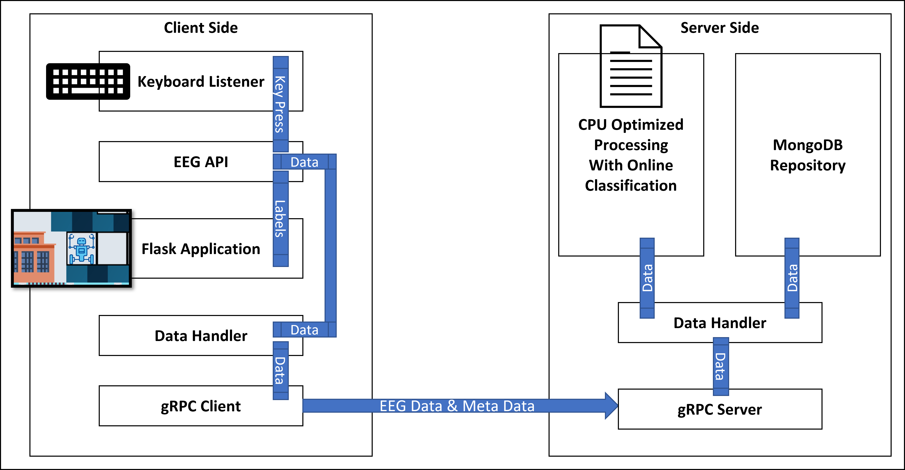

# EEG Based Silent Speech Classification Using A Transfer Learning Approach From Overt To Silent Speech
This repository holds the codebase for the implementation of my Computer Science M.Sc. Thesis at Saarland University with the [Ubiquitous Media Technology Lab](https://umtl.cs.uni-saarland.de/).
## Abstract
In Human-Computer Interaction, Silent Speech is defined as speech production in the absence of any audible sounds.  It can be used across multiple domains, for example in the medical domain for some forms of paralysis and Amyotrophic lateral sclerosis (ALS) patients, in the industrial domain for loud settings where workers cannot communicate efficiently using overt speech, and any other domain where overt speech is not possible. One of the methods used to detect Silent Speech is by measuring the brain activity using Electroencephalography (EEG) devices. However, collecting training data for detecting Silent Speech from EEG signals, is a burdensome process, because the participants must sit for long periods of time repeating the same group of words silently, which is quite time-consuming, mentally exhausting, boring, and difficult to validate the correctness of the words being said. In order to overcome these difficulties, my thesis proposed a transfer learning approach, for silent speech recognition from overt speech EEG data. We collected the EEG data from the participants during an online processing based gamified study, where they controlled a robot in a maze-like game, with five command words being said either overtly or silently. We used the overt speech EEG data to train a machine learning classifier, on a within-participant basis, that was then tested on silent speech EEG data. The main claim of the proposed system is that there are sufficient similarities between both forms of speech to enable a successful transfer learning outcome.
## Repository Explanation
The project is structured into three main folders
 - Thesisserver
 - ThesisClient
 - OfflineProcessing

Each of part is documented within its own folder. The OfflineProcessing is independent from the other two codebases, but it used the data collected by the client and server setup.
The data collection study for my thesis was in a client-server setup. The Thesisserver and ThesisClient depended on one another as they communicated together, over two separate PCs, during the data collection, while also processing the data in a real-time manner, but it was not the main focus of the thesis, that is why we conducted a detailed offline processing afterwards.
Some codes are not included due because they were implemented by the lab itself and other personnel. So, I cannot add them here as they are not mine.
The figure below shows the overview of the whole online processing pipeline together.

