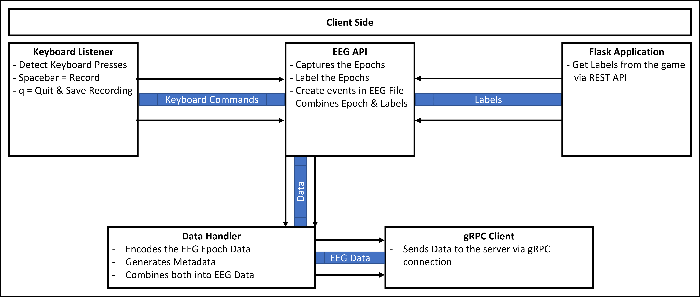

# Thesis

### Game
We created a game to use in the data collection of our study.
The game, consisted of four main parts, each part consisted of eight different levels, each level consisted of 25 command words where each of the five words “Up”, “Left”, “Right”, “Pick”, and “Push” was repeated five times. This led to collecting a total of 800 samples per participant. Where 400 samples were used for overt speech EEG data collection, and 400 samples for silent speech EEG data collection. Each speech type had 80 samples per each of the five words. In addition to all of this, a tutorial level was created so that the participants would get accustomed to the command words and the game mechanics.
The game was controlled via spacebar, and the transition between the different levels was done via a left click from the mouse.
The game communicated with the client-side by sending the labels via HTTP connection in a JSON format.  
At the end, the game was built and exported as an executable file (.exe).

### Keyboard Listener
Because the game was controlled by pressing the spacebar. We wanted to use the spacebar as the controller for the client-side implementation as a whole. This meant that when we pressed the spacebar, the events would be inserted in the EEG recording file, and the epoch would be captured.
In order to do so, we used the keyboard module from the pynput library to define a keyboard listener. When the listener started, it ran in the background capturing all the keyboard presses. We needed to define different actions for the needed keyboard key presses. For example, we defined that if the spacebar was pressed we sent a command “record” via queue to the EEG recorder. We used a queue to send the commands, because the keyboard module could not run on the same process as the EEG recorder. In addition, to prevent any double spacebar presses, by controlling how the EEG recorder popped the commands from the queue.

### Flask Application
We separated the game from the backend, so we would not need to know the word order in advance. This made it easier to introduce any changes to the game, without affecting the backend. To capture the labels sent from the game, we created a very simple Flask application, which ran a server on the localhost. The Flask server received the labels from the game via the HTTP request, and then sent the labels to the EEG recorder via queue.  

### EEG Recorder
The EEG recorder was the code where the EEG API was running. The recorder received the keyboard commands from the keyboard listener, and the labels from the flask application, via two different queues. Afterwards, the recorder set the EEG events in the EEG recording file. Furthermore, it captured each epoch, as a NumPy array, and sent it forwards via queue to a process called the data handler. In addition, from the moment we started recording, the EEG device recorder, kept everything in memory while we added the different events in the recording file, at the end of each study, we would save the recording of the whole study session as a .fif file.
### Data Handler
The data handler was running as a separate process. It received the EEG epochs along with the labels via queue from the EEG recorder. It encoded the EEG epoch into binary format, and then assembled the various pieces of information as a single data class which contained the exact data and formats that the gRPC client is expected to send via the gRPC connection. Afterwards, it passed the data to the gRPC client. We separated the gRPC client from the data handler, to utilize the layering concepts of separating each code base. So, if we wanted to exchange gRPC with something else, we would not need to rewrite the data handler.
### gRPC Client
The gRPC client received the data via queue from the data handler as a data class. It converted the received data class into the variable of the type described in the proto file. Afterwards, it sent the data to the server by passing it as a parameter to the method described in the proto file.
### Client Main
Each of the aforementioned processes was running on either a separate thread or a separate process, communicating together via queues. The main is where we started the whole codebase. In addition to being where we read the different configuration parameters from a config file, for example the gRPC server IP, and the participant id.  
