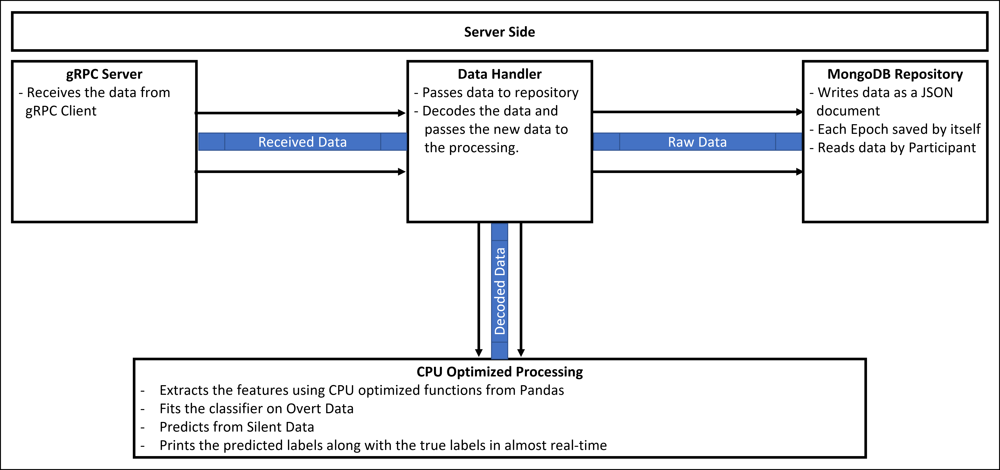

# Thesis

### gRPC Server
The gRPC server was the gateway through which the data was received. When the gRPC server received any data, it converted it to a predefined data class in order to facilitate the data handling by the other codes. Afterwards, it passed the converted data to the data handler via queue.
### Data Handler
The data handler was the junction point where the data received via the server, was forwarded to both the repository and the processing modules. It sent the data as received to the repository, but it decoded the data from the binary format back to a NumPy array before sending it to the processing code.
### Repository
The MongoDB server was running via Docker by using their official image, and it had a persistent volume, to make sure that the data persisted even if the database server stopped working.
The code implementation for dealing with the database, was written by using the PyMongo python library. When the repository received the data, it stored the data by dealing with the different variables as if they were a dictionary, which was then inserted into the database as a single document. In addition, the repository codebase, had a reader function, that, if given the participant ID, would return all the epochs belonging to that specific participant.
### Processing
The processing module, was responsible for, processing the incoming data. It worked by using Pandas and NumPy for processing the data, because both libraries had CPU optimized functions that enabled online processing. The data was received via queue from the data handler, then a five level wavelet packet decomposition  using the Symlets 7 was extracted from the epoch. After the wavelet decomposition, we extracted seven statistical features, which were mean, standard deviation, variance, kurtosis, skewness, average energy, and zero-crossing rate. After extracting the feature vector, the data speech type was checked, if the data was of type overt speech, the feature vector would be appended to the other extracted feature vectors. When we receive an indication, from the label, that the overt speech part ended, we would automatically fit the classifier to the extracted overt speech data features. Afterwards, when we received the data of type silent speech, we would feed the extracted feature vector to the classifier to predict the epoch label. The predicted label would be stored in a txt file along with the true label received with the epoch.
### Server Main
Each of the aforementioned processes was running on either a separate thread or a separate process, communicating together via queues. The main is where we started the whole codebase in addition to reading the different configuration parameters from a config file that held the gRPC server IP, the gRPC port number, the participant id, and the MongoDB parameters including the server IP, server port and database name.
